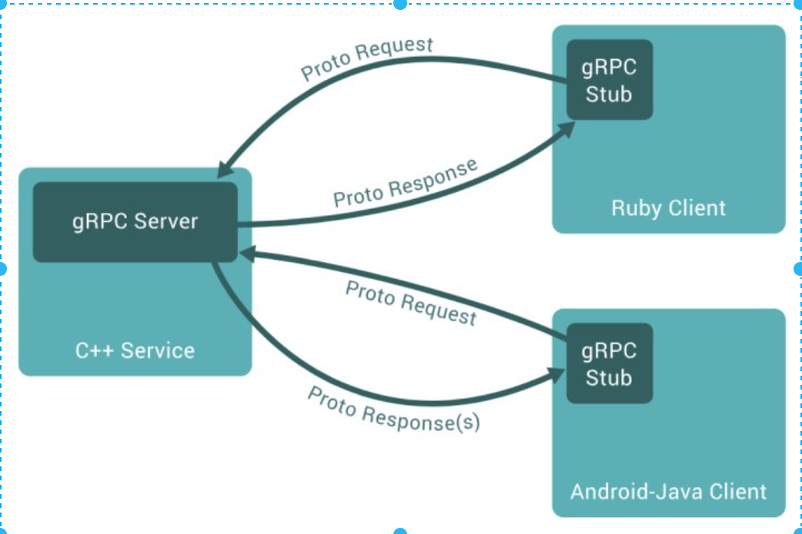
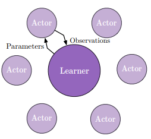
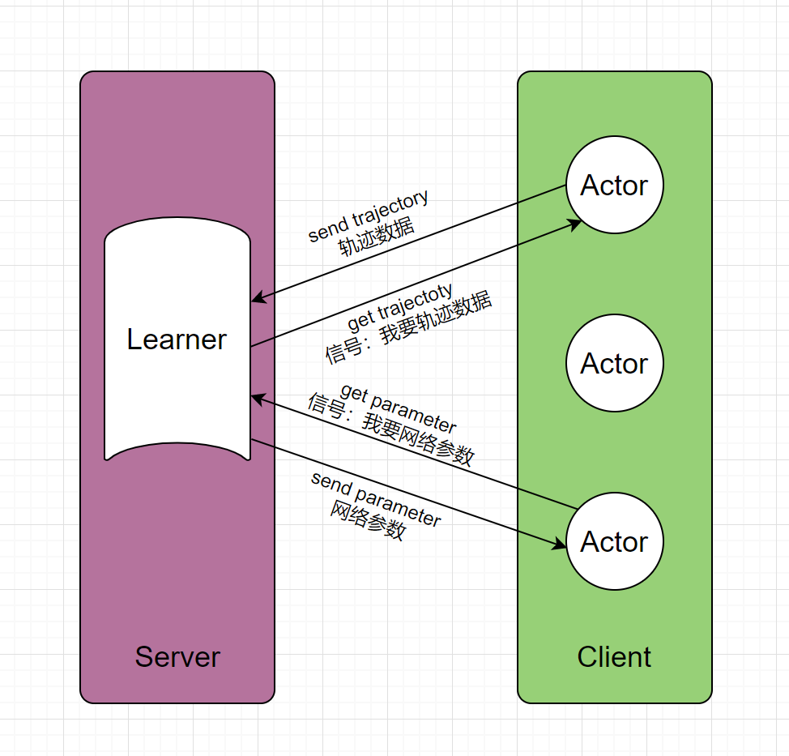

[toc]

# IMPALA

**IMPALA是一个基于gRPC的大规模分布式强化学习训练的强化学习框架。**

## gRPC

可以直接看强化学习部分

### 什么是RPC？

- RPC (Remote Procedure Call)即**远程过程调用**，是分布式系统常见的一种通信方法。它允许程序调用另一个地址空间（通常是共享网络的另一台机器上）的过程或函数，而不用程序员显式编码这个远程调用的细节。
- 除 RPC 之外，常见的多系统数据交互方案还有分布式消息队列、HTTP 请求调用、数据库和分布式缓存等。
- 其中 RPC 和 HTTP 调用是没有经过中间件的，它们是端到端系统的直接数据交互。

**简单的说**：

- RPC就是从一台机器（客户端）上通过参数传递的方式调用另一台机器（服务器）上的一个函数或方法（可以统称为服务）并得到返回的结果。
- RPC会隐藏底层的通讯细节（不需要直接处理Socket通讯或Http通讯）。
- 客户端发起请求，服务器返回响应（类似于Http的工作方式）RPC在使用形式上像调用本地函数（或方法）一样去调用远程的函数（或方法）。

### 为什么我们要用RPC?

- RPC 的主要目标是让构建分布式应用更容易，在提供强大的远程调用能力时不损失本地调用的语义简洁性。为实现该目标，RPC 框架需提供一种透明调用机制让使用者不必显式的区分本地调用和远程调用。

### 什么是gRPC?

其实就是谷歌（Google）开源的RPC，故称为gRPC，使用了一种特有是数据格式进行高效通信。我们在强化学习部分讲。

## 强化学习部分

gRPC通信框架如下，我把它的强化学习通信框架也画出来了（如下）。

如上图所示，服务端我们对应的是GPU来训练神经网络（梯度下降），而客户端就是我们的Actor（与环境交互的agent）。

我们可以理解为每一个进程对应一个Actor，Actor与环境做交互产生经验轨迹供Learner学习训练（梯度下降）。

>IMPALA智能体的策略网络调用forward(state)方法时（也就是网上常说的推断）使用CPU进行计算，这个过程也可以放在GPU上。放在GPU是SEED-RL上改进的，但是代码中尽量还原IMPALA代码。

### 使用IMALA带来的问题

与A3C不同，在A3C中，worker将关于策略参数传递给中央参数服务器，而Impala Actors将经验轨迹(状态、行动和奖励的序列)传递给集中的Learner。由于Impala的Learner已经获得了完整的经验轨迹，它使用GPU来执行小批量轨迹的更新，并行的收集经验和训练。这种解耦结构可以获得很高的吞吐量，但是由于用于生成轨迹的策略在梯度计算时可能会落后于学习者的策略多次更新，所以学习变成了Off-Policy，因此作者引入了V-trace Off-Policy Actor-Critic算法来纠正这种有害的差异。

### 学习过程：

1. 每个**Actor单独定期**地从Learner同步参数，然后进行数据收集(s, a, r, s')。

2. 所有Actor收集的数据都会**即时存储到数据采样队列**(queue)里。
3. 队列的数据达到**mini-batch**size时，Learner开始**梯度学习**，并更新其参数。
4. Actor与Learner**互不干扰**，Actor定期从Learner同步参数，Learner定量学习更新参数。
5. Learner也可以是**分布式集群**，这种情况下，Actor需要**从集群同步参数**。
6. Actor一般使用**CPU**，Learner使用**GPU**。

## 特点

**1，**与A2C相比，Actor采集数据**无需等待**，并由GPU快速统一学习。**2，**与A3C相比 ，Actor**无需计算梯度**，只需收集数据，数据吞吐量更大。**3，**与GA3C相比，引入**V-trace**策略纠错，同时接受**更大延迟**，方便大规模分布式部署Actors。**4，**框架拓展方便，支持**多任务**学习。

**5，**但是当场景包含很多终止条件的**Episode**，而又对这些终止(**Terimal**)敏感时，不管是在Actor收集数据时，还是在Learner梯度学习时，**分段处理**长短不一的Episode，都会大大降低IMPALA的性能，影响其流畅性；所以场景最好是Episode不会终止或者是对终止不敏感。

## 参考

